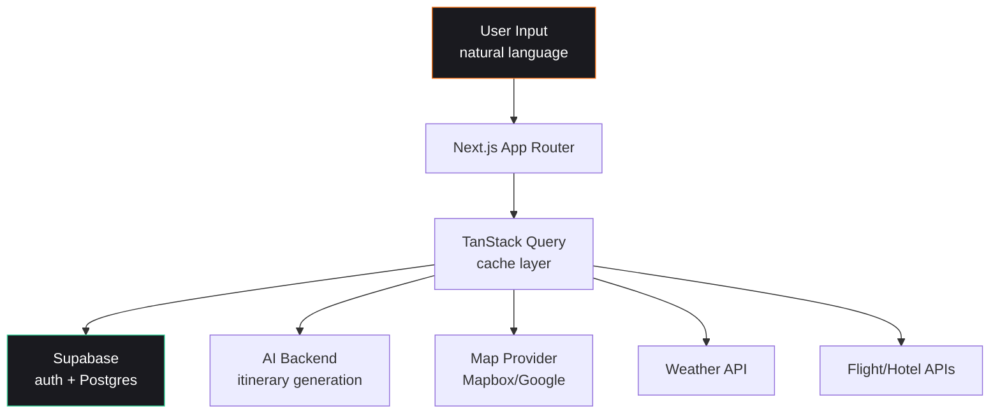

# AIKU — Senior Design Project Frontend

> Koç University Senior Design Project. AI-powered travel planning at full feature depth — itineraries, maps, flights, weather, budget.

[](https://nextjs.org/)
[](https://www.typescriptlang.org/)
[](https://supabase.com/)
[](https://tailwindcss.com/)
[](https://ui.shadcn.com/)

---

## What this is

**AIKU** is the Senior Design Project of [Koç University Comp491-aiku team](https://github.com/Comp491-aiku) — an AI-powered travel planning platform. This repo is the **full production frontend** with map integration, weather data, budget tracking, and flight/accommodation search.

For the standalone planner prototype, see [aiku_frontend](https://github.com/1lker/aiku_frontend).

---

## Features

| Capability | Detail |
|---|---|
| **AI itinerary generation** | Day-by-day schedules from natural-language trip descriptions |
| **Interactive itinerary builder** | Drag, edit, reorder activities per day |
| **Map integration** | Mapbox / Google Maps for location visualization |
| **Weather forecasts** | Per-destination forecast for travel dates |
| **Budget tracker** | Cost management across flights, lodging, activities |
| **Flight + accommodation search** | Integrated search across providers |
| **Auth + persistence** | Supabase auth + Postgres storage |
| **Dark mode** | Full theming support |
| **Animations** | anime.js for itinerary transitions and onboarding |

---

## Architecture



---

## Tech stack

| Layer | Choice |
|---|---|
| Framework | Next.js 15 (App Router) |
| Language | TypeScript (strict) |
| Styling | Tailwind CSS + shadcn/ui (Radix primitives) |
| State | Zustand |
| Data fetching | TanStack Query (React Query) |
| Backend | Supabase (auth + Postgres + SSR) |
| HTTP | Axios |
| Maps | Mapbox + Google Maps |
| Charts | Recharts |
| Animation | anime.js |
| Container | Docker |

---

## Quick start

### Local dev

```bash
git clone https://github.com/Comp491-aiku/senior-frontend.git
cd senior-frontend
npm install
cp .env.example .env.local   # add your Supabase + map keys

npm run dev
# → http://localhost:3000
```

### Type check + lint

```bash
npm run type-check
npm run lint
```

### Production build

```bash
npm run build
npm start
```

### Docker

```bash
docker build -t aiku-frontend .
docker run -p 3000:3000 aiku-frontend
```

---

## Configuration

Required environment variables (see `.env.example`):

```bash
NEXT_PUBLIC_SUPABASE_URL=
NEXT_PUBLIC_SUPABASE_ANON_KEY=
NEXT_PUBLIC_MAPBOX_TOKEN=
NEXT_PUBLIC_GOOGLE_MAPS_KEY=
NEXT_PUBLIC_API_URL=        # AIKU backend
```

---

## Project structure

```
src/
├── app/                # Next.js App Router pages
├── components/         # Reusable UI components (shadcn-based)
├── features/           # Feature-scoped modules (itinerary, map, search)
├── hooks/              # Custom React hooks
├── lib/                # API clients, Supabase client, utilities
├── stores/             # Zustand stores
└── types/              # Shared TypeScript types
```

---

## Team

Built by the **Comp491-aiku Senior Design team** at Koç University.

---

## Author (this repo's README)

**İlker Yörü** — CTO @ [Mindra](https://mindra.co)
[GitHub](https://github.com/1lker) · [LinkedIn](https://linkedin.com/in/ilker-yoru) · [ilkeryoru.com](https://ilkeryoru.com)

## License

MIT
